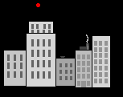



## Dooms Day

### Description

Here is a missle command type game i wrote in gwbasic then later ported to vb6. It's a blast to play and the code may have some educational

value. It is a fairly simple and neatly written piece of code using linked lists to track screen activity. It has increasingly difficult levels, up to the point of impossible. Levels are fully configurable by the user (# of bombs, smart bombs, missles, speed, etc.) Have fun!
 
### More Info
 

             |
---                |---
**Submitted On**   |2002-06-25 15:52:36
**By**             |[KennyG](https://github.com/Planet-Source-Code/PSCIndex/blob/master/ByAuthor/kennyg.md)
**Level**          |Intermediate
**User Rating**    |5.0 (20 globes from 4 users)
**Compatibility**  |VB 5\.0, VB 6\.0
**Category**       |[Games](https://github.com/Planet-Source-Code/PSCIndex/blob/master/ByCategory/games__1-38.md)
**World**          |[Visual Basic](https://github.com/Planet-Source-Code/PSCIndex/blob/master/ByWorld/visual-basic.md)
**Archive File**   |[Dooms\_Day988796262002\.zip](https://github.com/Planet-Source-Code/kennyg-dooms-day__1-36267/archive/master.zip)

